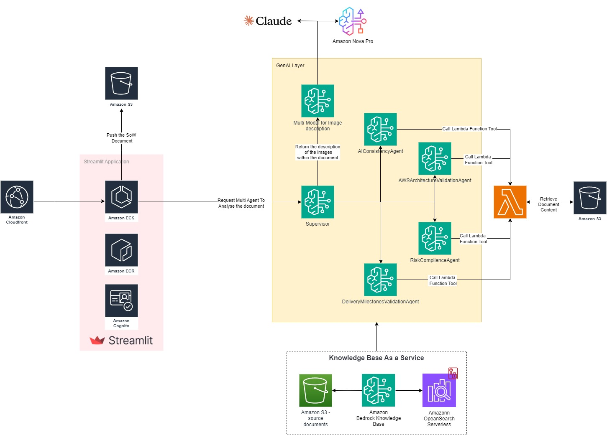

# Lightweight Multi-Agent Framework for Amazon Bedrock

## Overview

This project is a lightweight multi-agent framework designed to easily build and deploy multi-agent solutions on *
*Amazon Bedrock** using AWS **CDK (Cloud Development Kit)**. It provides infrastructure and tooling for developers to
create AI-powered agent workflows at scale.

## Features

- **AWS CloudFormation-based deployment** via AWS CDK
- **Multi-agent orchestration** using Amazon Bedrock
- **Fully lightweight** – powered solely by AWS Managed Services, with no reliance on third-party tools like LangChain
  or CrewAI!
- **Serverless architecture** leveraging AWS Lambda
- **OpenSearch integration** for AI-powered indexing
- **Configurable AI models** using Amazon Titan and other foundation models

## Prerequisites

Before setting up the project, ensure you have the following:

- **AWS CLI** installed and configured
- **Node.js (>= 14.x)** and **npm**
- **AWS CDK (>= 2.x)** installed globally (`npm install -g aws-cdk`)
- **Python 3.8+** with dependencies installed

## TL;DR

To quickly set up and deploy the multi-agent system, simply:

1. **Update the configuration file** at `backend/stacks/configuration/agent_config.yaml` with your custom agent
   definitions.
2. **Deploy the stack** using AWS CDK:

   ```bash
   cd backend
   pip install -r requirements.txt
   cdk deploy
   ```

## Installation

1. **Clone the Repository:**

   ```bash
   git clone <repo-url>
   cd Multi-agent-framework
   ```

2. **Install Dependencies:**

   ```bash
   pip install -r backend/requirements.txt
   ```

3. **Bootstrap AWS CDK (If running for the first time):**

   ```bash
   cdk bootstrap
   ```

## Project Structure

### Fail-Fast Boto3 for Quick Testing

The `fail_fast_boto3/` directory contains pre-built Python functions that allow users to quickly test **multi-agent
interactions** with **Amazon Bedrock** without deploying the full AWS CDK stack. This is useful for developers who want
to experiment with agent workflows using **boto3**, the AWS SDK for Python.

Inside this folder, you'll find:

- **Prompts**: XML-based agent instructions for different validation tasks.
- **Utils for Multi-Agent Bedrock**: Python scripts that allow you to create and test multi-agents directly via API
  calls, bypassing the need for infrastructure deployment.

This section is ideal for users who want to get started with Multi Agent on Amazon Bedrock and **debug agent behavior**
before fully deploying the solution with AWS CDK.

```
sow-validator/
│── code/
│   ├── services/  # Contains the Lambda functions that host the processing logic
│   │   ├── lambdas/
│   │   │   ├── __init__.py
│   │   │   ├── deploy-ecr-image.sh  # Script to deploy ECR image
│   │   │   ├── Dockerfile  # Docker configuration for Lambda packaging
│   │   │   ├── requirements.txt  # Python dependencies for Lambda functions
│── fail_fast_boto3/  # Contains pre-built Python functions for testing multi-agent interactions with Amazon Bedrock
│── reply_cdk_utils/  # General utility functions for CDK (naming conventions, IAM, etc.)
│   ├── __init__.py
│   ├── ConventionNaming.py  # Helper for consistent naming conventions
│   ├── iam.py  # IAM policy utilities
│   ├── parameter_store.py  # Helper for AWS SSM Parameter Store
│   ├── runtime_stacks_tagging.py  # Utility for tagging AWS CDK stacks
│   ├── s3.py  # S3 utility functions
│
│── stacks/  # AWS CDK infrastructure stacks
│   ├── configuration/
│   │   ├── agent_config.yaml  # Configuration for agent behavior
│   ├── cr/
│   │   ├── __init__.py
│   │   ├── cfnresponse.py  # CloudFormation response utilities
│   │   ├── Dockerfile  # Lambda deployment configuration for CDK custom resources
│   │   ├── multi_agent_lifecycle_handler.py  # Handles agent lifecycle events
│   │   ├── requirements.txt  # Dependencies for custom resource handlers
│   ├── prompts/  # AI agents and validation logic
│   │   ├── AIConsistencyAgent.xml
│   │   ├── AWSArchitectureValidationAgent.xml
│   │   ├── BusinessFinancialValidationAgent.xml
│   │   ├── DeliveryMilestonesValidationAgent.xml
│   │   ├── PDFImageAnalyzer.xml
│   │   ├── RiskComplianceAgent.xml
│   │   ├── SingleAgentSowValidator.xml
│   │   ├── StructuralComplianceAgent.xml
│   │   ├── SupervisorAgent.xml
│   │   ├── TechnicalScopeValidationAgent.xml
│   ├── __init__.py
│   ├── agent_loader.py  # Loads agents and orchestrates processing
│   ├── constants.py  # Stores constant values for agent execution
│   ├── core_stack.py  # Main CDK stack that initializes resources
│   ├── genai_layer.py  # Layer for Amazon Bedrock-based GenAI models
│   ├── kb_infra_stack.py  # Knowledge Base infrastructure stack
│   ├── lambdas_stack.py  # Stack defining Lambda functions
│   ├── openss_infra_stack.py  # OpenSearch Serverless infrastructure
│   ├── standalone_genai_layer.py  # Separate GenAI processing layer
│   ├── vpc_stack.py  # Defines networking and VPC resources
│
│── tests/  # Contains unit tests
```

## Configuration

### Agent Configuration (`backend/stacks/configuration/agent_config.yaml`)

Below is the structure of `agent_config.yaml`, which defines how agents are set up and interact within the framework.

| Parameter                  | Description                                                                                                      |
|----------------------------|------------------------------------------------------------------------------------------------------------------|
| `project_name`             | The name of the project, used for to prefix the naming agents dynamically.                                       |
| `agents`                   | A dictionary containing agent definitions.                                                                       |
| `agent_name`               | The unique name of the agent.                                                                                    |
| `instruction_file`         | The XML file path containing agent-specific instructions                                                         |
| `collaborator_order`       | The order is not really used by the supervisor, but it's more for you to keep track of the logic in those agents |
| `activate`                 | Boolean flag to enable or disable the agent.                                                                     |
| `to_collaborate`           | Boolean flag indicating if this agent collaborates with others or should be created standalone                   |
| `foundation_model`         | The AI model used by this agent.                                                                                 |
| `knowledge_base`           | Boolean indicating if the agent leverages the knowledge base created only when deploying the full sack with KB   |
| `agent_action_group`       | A list of actions that this agent can perform. The names must match their definitions in the GenAI layer stack.  |
| `collaborator_instruction` | Instructions for the supervisor to when call this collaborator.                                                  |

Example `agent_config.yaml` entry:

```yaml
project_name: "checksow"

agents:
  analyse_image_document:
    agent_name: "${project_name}-AnalyseImagePdf"
    instruction_file: "PDFImageAnalyzer.xml"
    collaborator_order: 0
    activate: True
    to_collaborate: True
    foundation_model: "anthropic.claude-3-sonnet-20240229-v1:0"
    knowledge_base: True
    agent_action_group: [ "agent_analyse_image_in_document" ] # The action name must match its declaration in the GenAI layer stack.
    collaborator_instruction: "Always start by calling this agent first to analyze images in the Statement of Work (SoW) and provide initial context for subsequent agents."
```

Modify `backend/cdk.context.json` to set up **environment-specific** configurations. Below is a structured breakdown of
the configuration parameters:

| Parameter                              | Description                                                                                                                         |
|----------------------------------------|-------------------------------------------------------------------------------------------------------------------------------------|
| `ACCOUNT_ID`                           | AWS Account ID for deployment                                                                                                       |
| `REGION`                               | AWS Region for deployment                                                                                                           |
| `VPC_ID`                               | Virtual Private Cloud (VPC) ID if you do not want to use existing VPC, remove the parameter and a VPC stack will be created for you |
| `Environment`                          | Deployment environment (e.g., `dev`)                                                                                                |
| `RESOURCE_PREFIX`                      | Prefix for AWS resource names                                                                                                       |
| `BEDROCK_REGION_NAME`                  | Amazon Bedrock Region for AI models  (in case you would like to access models that are in US)                                       |
| `PROJECT_AGENT_NAME`                   | Name of the AI agent                                                                                                                |
| `KB_DOCS_S3_BUCKET_NAME`               | S3 bucket for storing documents                                                                                                     | |
| `AGENT_FOUNDATION_MODEL`               | AI Model used                                                                                                                       |
| `KB_CONFIGURATION.OSS_COLLECTION_NAME` | OpenSearch collection name                                                                                                          |
| `KB_CONFIGURATION.OSS_INDEX_NAME`      | OpenSearch index name                                                                                                               |
| `STANDALONE_GENAI_LAYER`               | Flag to enable standalone GenAI layer if you do not need a KnowledgeBase for your agents (like RAG application)                     |
| `STACK-TAGS.Environment`               | Environment tag                                                                                                                     |
| `STACK-TAGS.Domain`                    | Domain tag (e.g., `Analytics`)                                                                                                      |
| `STACK-TAGS.WorkloadName`              | Workload name tag                                                                                                                   |
| `STACK-TAGS.BusinessUnit`              | Business unit tag                                                                                                                   |
| `STACK-TAGS.Owner`                     | Stack owner tag                                                                                                                     |
| `STACK-TAGS.CostCenter`                | Cost center tag                                                                                                                     |
| `STACK-TAGS.Product`                   | Product name tag                                                                                                                    |

```json
{
  "DeploymentEnvironments": {
    "dev": {
      "ACCOUNT_ID": "12345678910",
      "REGION": "eu-west-3",
      "VPC_ID": "vpc-XXXXX",
      "Environment": "dev",
      "RESOURCE_PREFIX": "sowcheck",
      "BEDROCK_REGION_NAME": "us-west-2",
      "PROJECT_AGENT_NAME": "sowchecker",
      "KB_DOCS_S3_BUCKET_NAME": "reply-sow-validator",
      "AGENT_FOUNDATION_MODEL": "anthropic.claude-3-sonnet-20240229-v1:0",
      "KB_CONFIGURATION": {
        "OSS_COLLECTION_NAME": "sowcheck-drf",
        "OSS_INDEX_NAME": "kb-input-doc"
      },
      "STANDALONE_GENAI_LAYER": true,
      "STACK-TAGS": {
        "Environment": "dev",
        "Domain": "Analytics",
        "WorkloadName": "<WORKLOAD_NAME>",
        "BusinessUnit": "<BUSINESS_UNIT>",
        "Owner": "<STACK_OWNER>",
        "CostCenter": "<COST_CENTER>",
        "Product": "Reply Multi Agent Validator"
      }
    }
  }
}
```

## Available Tools

This framework provides built-in tools for document processing and image analysis through Amazon Bedrock's **Agent
Action Groups**. These tools allow agents to interact with external services, such as **S3 file retrieval** and **image
analysis within PDFs**.

| Tool Name                  | Description                                                                                                                                              | Parameter                                                                       |
|----------------------------|----------------------------------------------------------------------------------------------------------------------------------------------------------|---------------------------------------------------------------------------------|
| `get_document_from_s3`     | Retrieves a document from an S3 bucket using a provided S3 URI.                                                                                          | `s3_uri_path` (string) - The S3 URI of the document to be retrieved.            |
| `analyse_images_documents` | Extracts images from a PDF stored in S3 and generates textual descriptions from the base64 for them using an MultiModel AI model. (Support only PDF now) | `s3_uri_path` (string) - The S3 URI of the original document containing images. |

**Note**: You will need to ask the agent in a way that it understand the S3 uri for example: "my document in the
following s3 path : s3://<bucket_name>/<prefix>/<document_name>"

#### Tool Definitions:

##### `backend/stacks/standalone_genai_layer.py`

```python
agent_get_s3_file = CfnAgent.AgentActionGroupProperty(
    action_group_name="lambda_processing_sow",
    action_group_executor=bedrock.CfnAgent.ActionGroupExecutorProperty(
        lambda_=self.sow_check_tools.function_arn
    ),
    action_group_state="ENABLED",
    description="Responsible for calling the lambda function to download the S3 URL and return the content of the files",
    function_schema=bedrock.CfnAgent.FunctionSchemaProperty(
        functions=[bedrock.CfnAgent.FunctionProperty(
            name='get_document_from_s3',
            description='The S3 URL to use to download the Statement of Work from S3.',
            parameters={
                "s3_uri_path": bedrock.CfnAgent.ParameterDetailProperty(
                    type="string",
                    description="The S3 URI of the document",
                    required=True
                )
            },
            require_confirmation="DISABLED"
        )]
    )
)
```

#### Business Logic Implementation:

The core logic behind these tools is implemented in an AWS Lambda function that processes the requests and returns
results. Below is the implementation of the **Lambda function** handling both tools:
Here an example of how you can add your own tool, in our case the function the agent will look for is "
get_document_from_s3" and will pass the parameter "s3_uri_path"

```python

import json


def lambda_handler(event, context):
    print(event)
    actionGroup = event.get('actionGroup')
    function = event.get('function')
    parameters = event.get('parameters', [])
    response_body = {"TEXT": {"body": "Error, no function was called"}}

    if function == 'get_document_from_s3':
        s3_uri_path = next((param["value"] for param in parameters if param["name"] == "s3_uri_path"), None)
        if not s3_uri_path:
            raise Exception("Missing mandatory parameter: s3_uri_path")
        try:
            document_content = read_s3_url(s3_uri_path)
            response_body = {'TEXT': {"body": document_content}}
        except Exception as e:
            response_body = {'TEXT': {"body": f"An error occurred: {str(e)}"}}

    if function == '<name_of_function_2_recognized_by_the_supervisor>':
        s3_uri_path = next((param["value"] for param in parameters if param["name"] == "s3_uri_path"), None)
        if not s3_uri_path:
            raise Exception("Missing mandatory parameter: s3_uri_path")
        try:
            RESULT = YOUR_FUNCTION_CALL()
            response_body = {'TEXT': {"body": RESULT}}
        except Exception as e:
            response_body = {'TEXT': {"body": f"An error occurred: {str(e)}"}}

    return {'response': {'actionGroup': actionGroup, 'function': function,
                         'functionResponse': {'responseBody': response_body}},
            'messageVersion': event['messageVersion']}
```

These tools provide **modular capabilities** within the multi-agent framework, allowing users to easily extend or
replace existing tools based on their needs.

## Example Use Case

This lightweight framework is designed to support a modular multi-agent architecture, allowing users to define their own
agents in /stacks/configuration/agent_config.yaml. By updating the agent configuration, users can create multi-agent
workflows tailored to their specific needs, whether it's document validation, data analysis, or any other task requiring
AI-driven orchestration.

For example, in our use case, we demonstrate how this framework can validate a Statement of Work (SoW) or contract
through a Supervisor Agent orchestrating multiple Collaborator Agents, each handling a specialized task. Additionally,
this system supports multi-modal AI capabilities, such as leveraging AnalyzeImageDocument to process and validate images
within the contract.
The code include a sample use case:

- **Supervisor-Agent Orchestration**: A Supervisor coordinates tasks, assigns them to Collaborator Agents, and ensures
  smooth execution.

- **Collaborator Agents for Specialized Tasks**: Each Collaborator is designed to handle a specific domain, such as:

    - **AIConsistencyAgent**: Ensuring AI-generated content maintains
      coherence. `backend/stacks/prompts/AIConsistencyAgent.xml`
    - **AWSArchitectureValidationAgent**: Validating AWS architecture against best
      practices. `backend/stacks/prompts/AWSArchitectureValidationAgent.xml`
    - **BusinessFinancialValidationAgent**: Evaluating financial aspects of a business
      proposal. `backend/stacks/prompts/BusinessFinancialValidationAgent.xml`
    - **RiskComplianceAgent**: Assessing compliance and risk factors. `backend/stacks/prompts/RiskComplianceAgent.xml`
    - **DeliveryMilestonesValidationAgent**: Verifying that project milestones align with contractual
      agreements. `backend/stacks/prompts/DeliveryMilestonesValidationAgent.xml`

- **Multi-Modal AI Capabilities**: Leveraging AnalyzeImageDocument to process and validate images within the Statement
  of Work by calling the function analyse_images_documents within the agent tool
- **Multi-Agent Decision Making**: The Supervisor-Agent framework allows dynamic adjustments in task execution based on
  AI-driven insights.

### SoW Validator Architecture

Bellow the architecture of the example SoW validator implemented through the Lightweight Multi-Agent Framework


## Deploying

To deploy:

```bash
cd backend
cdk list
cdk deploy <YOUR_STACK>
```

## Testing

To run tests using `pytest`:

```bash
cd backend
export PYTHONPATH=$PYTHONPATH:$(pwd)
pytest --cov=backend
```

### Deploy and Test with Streamlit

After deploying the GenAI layer stack, you need to configure the system parameters before running the Streamlit
application. To do this, fill in the required values and run the script `put_ssm_configurations.sh`.
And you can deploy a Cognito for authentication

#### **1. Retrieve Deployment Parameters**

Once the **GenAI layer stack** is deployed, retrieve the following parameters:

- `SUPERVISOR_AGENT_ID`: The ID of the Supervisor Agent.
- `SUPERVISOR_AGENT_ALIAS_ID`: The alias ID for the Supervisor Agent.
- `BEDROCK_REGION`: The Amazon Bedrock region in use.
- `RAG_BUCKET_NAME`: The name of the RAG (Retrieval-Augmented Generation) bucket. (if you went with Standalone , you can
  put the dummy bucket output for both the RAG and SOW'
- `SOW_BUCKET_NAME`: The name of the S3 bucket storing Statements of Work (SoW).
- `LANGFUSE_PUBLIC_KEY`: Public key for Langfuse integration.
- `LANGFUSE_SECRET_KEY`: Secret key for Langfuse integration.
- `LANGFUSE_HOST`: Hostname for Langfuse.
- `USER_POOL_ID`: Cognito User Pool ID.
- `USER_POOL_CLIENT_ID`: Cognito User Pool Client ID.
- `USER_POOL_CLIENT_SECRET`: Cognito User Pool Client Secret.
- `USER_POOL_COGNITO_DOMAIN`: Cognito User Pool Domain.
- `USER_POOL_REDIRECT_URI`: Cognito User Pool Redirect URI.

#### **2. Configure System Parameters**

Update the system parameters using the provided script:

```bash
chmod +x put_ssm_configurations.sh
./put_ssm_configurations.sh
```

## Possible Improvements

Here are some potential improvements that can enhance the functionality and robustness of the multi-agent system:

1. **Amazon Bedrock Guardrails Integration**
    - Implement **Amazon Bedrock Guardrails** to enhance security, compliance, and safety when executing agent
      workflows. This ensures controlled and ethical AI interactions while mitigating risks in decision-making.

2. **Custom Orchestration for Multi-Agent Workflows**
    - Extend beyond the **DEFAULT orchestration** by implementing **custom orchestration** strategies to improve agent
      decision-making and collaboration. More details on custom orchestration can be found in
      the [AWS Documentation](https://docs.aws.amazon.com/bedrock/latest/userguide/agents-custom-orchestration.html).

3. **Function Decorator for Tool Creation**
    - Develop a **function decorator** to simplify tool creation, allowing Python functions to be tested outside the
      stack before deployment. This ensures robust tool performance and easier debugging without needing full
      infrastructure deployment.

## Acknowledgements

A special thanks to GitHub user [maxritter](https://github.com/maxritter) for his Streamlit application for testing
multi-agent workflows, which has been a valuable reference for improving this project.
Github repo if you are interested in a similar stack built on
Typescript:  https://github.com/maxritter/aws-bedrock-multi-agent-blueprint/tree/main

## Contributing

Contributions are welcome! Please follow the standard **GitHub flow** for submitting pull requests.

If you want to work with me (on your next Agent project on AWS), please get in touch via:

[](https://www.linkedin.com/in/amineaitelharraj/)


## License

This project is licensed under the **MIT License**.

